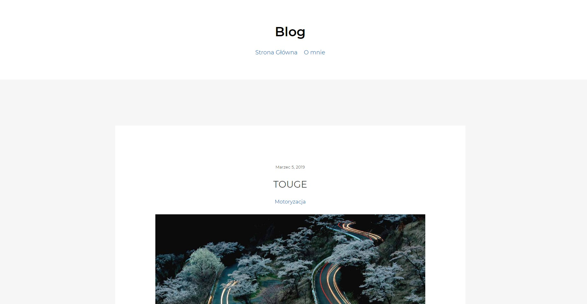
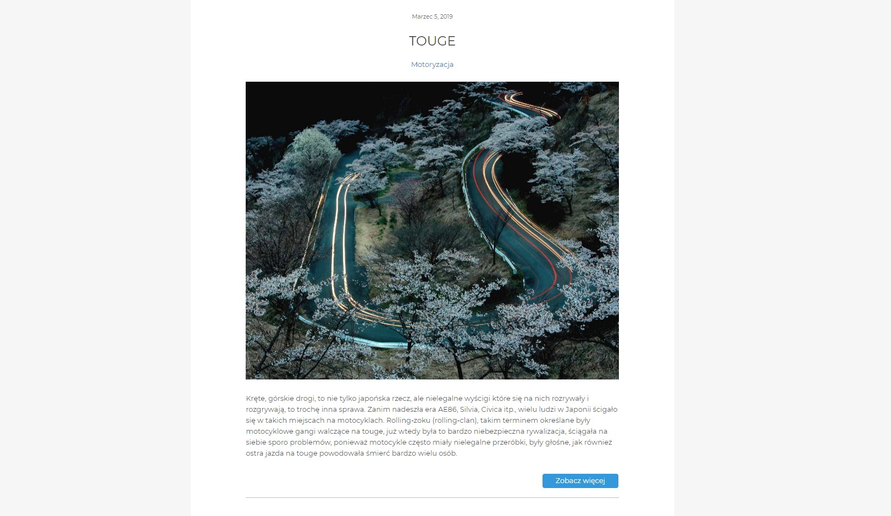

# GraphQL Blog

> A blog built with Static-Site Generator GatsbyJS and GraphCMS
- [GatsbyJS](https://www.gatsbyjs.org/)
- [GraphCMS](https://graphcms.com/)

## Technologies
* GatsbyJS - version 2.1.20
* GraphCMS

## Status
Project is finished.

## Compilation and usage

* git clone
* cd graphql-blog
* npm install 
* gatsby develop
> Then go to http://localhost:8000/ and see results

## Screenshots

    

    

### License

MIT
